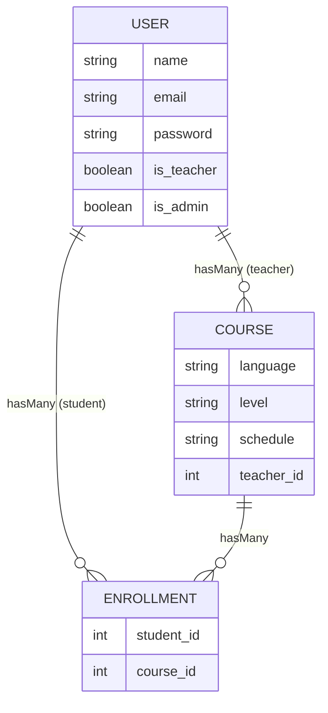

# Cool School Hub — Project Overview

## App Description

**Cool School Hub** is a web application for a language school. It allows teachers and students to log in and view information related to their courses.

- **Teachers** can see the courses they teach, including the **language**, **level**, **schedule**, and **list of enrolled students**. They can **create new courses**, and **edit or delete their own courses**.
- **Students** can see the courses they are enrolled in, including the **language**, **level**, **teacher**, and **schedule**. They can **enroll themselves** in the courses they want, and **unenroll** from them. A student can be enrolled in more than one course at the same time (e.g. Italian A2 and English B1).
- The **admin** can see and edit everything: all courses, all enrollments, and all users. The admin also marks users as teachers.
- New users can **register** themselves. Every new user starts as a student. The admin promotes a user to teacher.

### Who Can Do What

| Action                              | Student | Teacher      | Admin |
| ----------------------------------- | ------- | ------------ | ----- |
| See own courses                     | ✅      | ✅           | ✅    |
| See the course catalog              | Only courses not enrolled in | All | All |
| See a course's student list         | ❌      | Only own     | ✅    |
| Create a course                     | ❌      | ✅           | ✅    |
| Edit a course                       | ❌      | Only own     | ✅    |
| Delete a course                     | ❌      | Only own     | ✅    |
| Enroll in a course                  | ✅ self | ❌           | ✅ anyone |
| Leave a course (unenroll)           | ✅ self | ❌           | ✅ anyone |
| Promote a user to teacher           | ❌      | ❌           | ✅    |
| Edit another user's name and email  | ❌      | ❌           | ✅    |

The application uses three models: `User`, `Course`, and `Enrollment`.

- `User` represents teachers, students and the admin.
- `Course` stores the course information.
- `Enrollment` connects students to their courses. It stays a real model (with migration and factory) because the assessment requires at least 3 models.

## Models

### User

| Type    | Field        |
| ------- | ------------ |
| string  | `name`       |
| string  | `email`      |
| string  | `password`   |
| boolean | `is_teacher` |
| boolean | `is_admin`   |

| User type | `is_teacher` | `is_admin` |
| --------- | ------------ | ---------- |
| Student   | `false`      | `false`    |
| Teacher   | `true`       | `false`    |
| Admin     | `false`      | `true`     |

- Both columns default to `false`, so a newly registered user is a student.
- Only the admin can change `is_teacher`. Neither column can be set from the register form.
- Only the seeded admin user has `is_admin` set to `true`. It cannot be changed from any form, not even by the admin, so the app can never be left without an admin. Its login is `admin@admin.com` / `password`, as required by the assessment criteria.

### Course

| Type   | Field        |
| ------ | ------------ |
| string | `language`   |
| string | `level`      |
| string | `schedule`   |
| int    | `teacher_id` |

### Enrollment

| Type | Field        |
| ---- | ------------ |
| int  | `student_id` |
| int  | `course_id`  |

### Entity-Relationship Diagram

## Naming of the Relations

- A teacher (`User` with `is_teacher = true`) **hasMany** courses.
- A `Course` **belongsTo** a teacher (`User`).
- A student (`User` with `is_teacher = false`) **hasMany** enrollments.
- An `Enrollment` **belongsTo** a student (`User`).
- A `Course` **hasMany** enrollments.
- An `Enrollment` **belongsTo** a course.

## Pages (Routes)

### Public

| Method | URI         | Route name |
| ------ | ----------- | ---------- |
| GET    | `/`         | `home`     |
| GET    | `/login`    | `login`    |
| GET    | `/register` | `register` |

Login, register, logout and password reset come with the Laravel Breeze starter kit, already installed in the project (`routes/auth.php`).

### Logged-in users (students, teachers and the admin)

All these routes use the `auth` middleware. There is **one set of course pages for everyone**: what a page shows, and which buttons appear, depends on who is logged in.

| Method    | URI                                            | Route name                     | What it does                                                        |
| --------- | ---------------------------------------------- | ------------------------------ | ------------------------------------------------------------------- |
| GET       | `/dashboard`                                   | `dashboard`                    | "My courses": the courses I teach (teacher) or I'm enrolled in (student, with an "Unenroll" button). The admin sees all courses. |
| GET/PATCH/DELETE | `/profile`                              | `profile.edit`, `profile.update`, `profile.destroy` | Edit my profile, change my password, delete my account (from the starter kit). |
| GET       | `/courses`                                     | `courses.index`                | Course catalog. Students see only the courses they are **not** enrolled in yet, and enroll here. Teachers and the admin see all courses. |
| GET       | `/courses/create`                              | `courses.create`               | Form to add a course (teacher, admin).                              |
| POST      | `/courses`                                     | `courses.store`                | Save the new course (teacher, admin).                               |
| GET       | `/courses/{course}`                            | `courses.show`                 | Course details. The list of students is shown only to the course's teacher and the admin. |
| GET       | `/courses/{course}/edit`                       | `courses.edit`                 | Form to edit a course (its teacher, admin).                         |
| PUT/PATCH | `/courses/{course}`                            | `courses.update`               | Save the changes (its teacher, admin).                              |
| DELETE    | `/courses/{course}`                            | `courses.destroy`              | Delete the course and its enrollments (its teacher, admin).         |
| POST      | `/courses/{course}/enrollments`                | `courses.enrollments.store`    | Enroll: a student enrolls themselves; the admin can enroll any student. |
| DELETE    | `/courses/{course}/enrollments/{enrollment}`   | `courses.enrollments.destroy`  | Unenroll: a student removes themselves; the admin can remove anyone. |

`courses.*` is the **full CRUD (all 7 methods)** required by the assessment.

### Admin only

These routes are in one group with the prefix `/admin`, the name prefix `admin.`, and the `auth` + `admin` middleware.

| Method    | URI                        | Route name          | What it does                         |
| --------- | -------------------------- | ------------------- | ------------------------------------ |
| GET       | `/admin/users`             | `admin.users.index` | List all users.                      |
| GET       | `/admin/users/{user}/edit` | `admin.users.edit`  | Form to edit a user's name and email and promote them to teacher. |
| PATCH     | `/admin/users/{user}`      | `admin.users.update`| Validate and save the changes to `name`, `email` and `is_teacher`. |

## Rules

- A teacher can only edit and delete **their own** courses. The admin can edit and delete any course.
- When a **teacher** creates a course, they become its teacher automatically. When the **admin** creates a course, they choose the teacher.
- A student can enroll in the same course **only once**.
- For a student, a course is shown **either** on the dashboard (enrolled) **or** in the catalog (not enrolled), never in both.
- When a course is deleted, all its enrollments are deleted with it (cascade delete).
